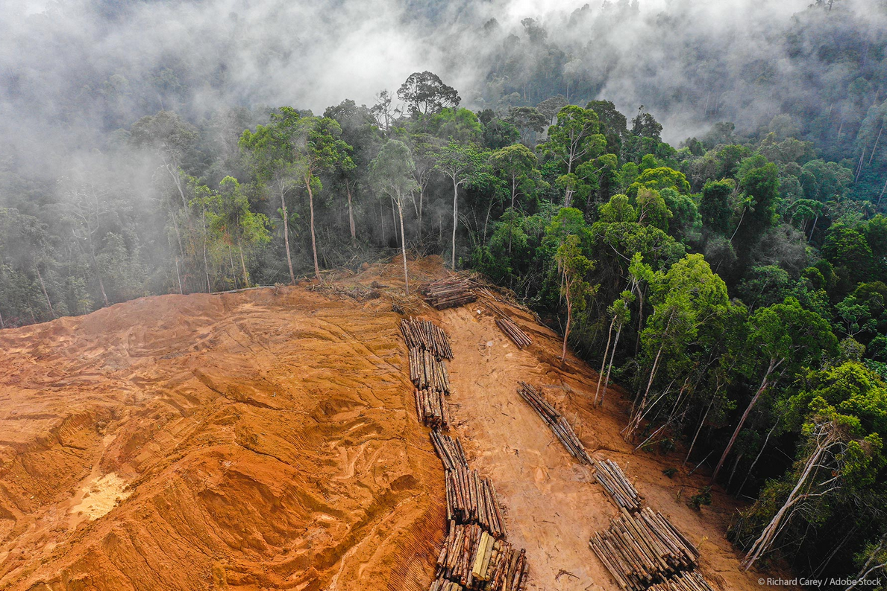
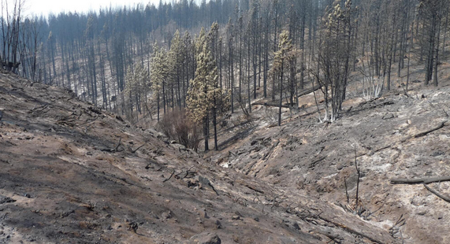
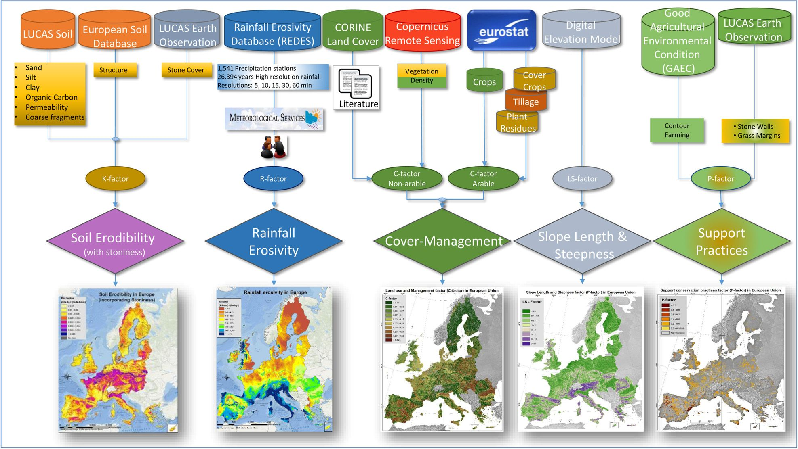
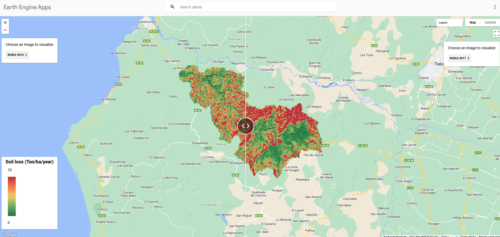

Soil erosion is a process that occurs when soil is displaced or removed from its original location, typically due to the action of wind, water, or human activities such as deforestation (Figure 1). It is a significant environmental concern, as it leads to the loss of fertile topsoil, decreases agricultural productivity, and has adverse effects on ecosystems. We will explore the concept of soil erosion, with a specific focus on the relationship between forest fires, pine plantations, and soil erosion. Furthermore, we will introduce the Revised Universal Soil Loss Equation (RUSLE) model, a widely used tool to estimate potential soil loss.

*Figure 1. Soil erosion due rainforest deforestation. Photo credit: Richard Carey*

Forest fires can have a profound impact on soil erosion rates. When a fire ravages a forest or a pine plantation, it significantly alters the natural balance and structure of the ecosystem. The heat generated during a fire can cause physical and chemical changes in the soil, leading to increased erosion susceptibility (Figure 2).

One of the critical consequences of forest fires is the destruction of vegetation cover. Vegetation, including trees, shrubs, and ground cover, plays a crucial role in reducing soil erosion. The roots of plants bind the soil particles together, creating a stable structure that can withstand the erosive forces of wind and water. The loss of vegetation due to fire leaves the soil exposed and vulnerable to erosion.

Additionally, the intense heat from forest fires can cause the formation of a waxy layer on the soil surface, known as a hydrophobic layer. This layer repels water, preventing it from infiltrating into the soil. As a result, rainfall is more likely to run off the surface, increasing the risk of water erosion. The combination of reduced vegetation cover and the hydrophobic layer significantly amplifies soil erosion rates in post-fire landscapes.

*Figure 2. Fire in California consumed much of the forest canopy, resulting in tree mortality, exposure of soil to erosion and increased water runoff. Photo credit: [USDA Forest Service](https://www.fs.usda.gov/) / Creative Commons*

To estimate potential soil loss, researchers and land managers often use the Revised Universal Soil Loss Equation (RUSLE) model. The RUSLE is an empirical model that calculates long-term average annual soil loss due to sheet and rill erosion. The model considers six main factors controlling soil erosion: the erosivity of the eroding agents (water), the erodibility of the soil (including stoniness), the slope length and slope steepness of the land, the land cover and management (or human practices designed to control erosion) [European Environment Agency, 2016](https://www.eea.europa.eu/data-and-maps/figures/rusle-soil-erosion-model-structure/rusle-soil-erosion-model-structure) (Figure 3). 

*Figure 3. RUSLE model implemented for Europe by [European Environment Agency, 2016](https://www.eea.europa.eu/data-and-maps/figures/rusle-soil-erosion-model-structure/rusle-soil-erosion-model-structure)*

This demonstration aims to showcase the workflow of using remote sensing data, starting from data gathering from various sources, performing necessary preprocessing, analysis, visualization, and data export.

In this demo, we will calculate the annual soil loss (ton/ha/year) using the empirical model called the Revised Universal Soil Loss Equation (RUSLE). The entire workflow will be conducted in the [Google Colaboratory environment](https://colab.research.google.com/drive/1u0JRuO5HrthL1DkcvRMlEU3lxLkayz2_?usp=sharing).

We will utilize the Python programming language and the Google Earth Engine API. Exclusively satellite data will be used as input, as described below:

#### 1. Precipitation

The precipitation data is derived from the [Climate Hazards Group InfraRed Precipitation With Station Data model (Version 2.0)](https://developers.google.com/earth-engine/datasets/catalog/UCSB-CHG_CHIRPS_DAILY). It provides daily precipitation data at a quasi-global level and is generated using various satellite data and meteorological stations (Funk et al., 2015).

With the precipitation data, we can calculate the R factor of the RUSLE model.

#### 2. Soils

The soil data is obtained from the [OpenLandMaps](https://developers.google.com/earth-engine/datasets/catalog/OpenLandMap_SOL_SOL_BULKDENS-FINEEARTH_USDA-4A1H_M_v02) database hosted in the Google Earth Engine catalog. These data correspond to the textural class of the top 10 cm of soil.

With the soil data, we can calculate the K factor of the RUSLE model.

#### 3. Digital Elevation Model (DEM)

The DEM used is from the [Shuttle Radar Topography Mission (SRTM)](https://developers.google.com/earth-engine/datasets/catalog/CGIAR_SRTM90_V4), which was downloaded from the Google Earth Engine catalog with a spatial resolution of 90 m.

With the DEM, we can estimate the L and S factors of the RUSLE model.

#### 4. Photosynthetic Vigor

The data associated with photosynthetic vigor corresponds to the Normalized Difference Vegetation Index (NDVI) calculated using images from the [Landsat 8 Tier 1 surface reflectance](https://developers.google.com/earth-engine/datasets/catalog/LANDSAT_LC08_C02_T1_L2) series. The complete satellite series is loaded, the relevant bands (NIR and RED) are selected, and the vegetation index is calculated.

With the photosynthetic vigor data, we can estimate the C factor of the RUSLE model.

#### 5. Land Cover

The land cover data corresponds to the "Landcover" from [MODIS](https://developers.google.com/earth-engine/datasets/catalog/MODIS_061_MCD12Q1), which provides a soil cover map at a spatial resolution of 500 m once per year.

The RUSLE model was calculated for the year 2014 and 2017 in Empedreado watershed in central Chile. A watershed dominated by commercial pine plantations. This watershed was almost totally burnt during "Las Maquinas" wildfire in 2017. In figure 4 we can see the effect of the wildfire in the potential erosion trough the split panel map. High slope areas suffered more after the fire and also where pines were burnt.

*Figure 4. [Google Earth Engine web application](https://lucasriveroiribarne.users.earthengine.app/view/ruslefires) to show the results of running RUSLE model on Empedrado watershed for the year 2014, before fire and 2017 the "Las Maquinas" fire year.*

Soil erosion is a complex process influenced by various factors, including land use practices and natural disturbances such as forest fires. Forest fires in both natural forests and pine plantations can result in increased soil erosion rates due to the loss of vegetation cover, the formation of hydrophobic layers, and weakened root systems. Understanding the relationship between soil erosion and forest fires is crucial for developing effective land management strategies to mitigate erosion, protect ecosystems, and promote sustainable land use practices. Models as RUSLE could help decision makers to manage natural resources, prioritizing measures that increase the health of ecosystems instead of just the economic revenue.

All the data required to do the analysis and figures is available under [GPLv3](https://www.gnu.org/licenses/gpl-3.0.html) license in my [GitHub repository](https://github.com/LRiveroIribarne/visualization-portfolio) :)

----

## References

Funk, C., Peterson, P., Landsfeld, M., Pedreros, D., Verdin, J., Shukla, S., ... & Michaelsen, J. (2015). The climate hazards infrared precipitation with stations—a new environmental record for monitoring extremes. Scientific data, 2(1), 1-21.

Tomislav Hengl. (2018). Soil bulk density (fine earth) 10 x kg / m-cubic at 6 standard depths (0, 10, 30, 60, 100 and 200 cm) at 250 m resolution (Version v02) [Data set]. Zenodo. 10.5281/zenodo.1475970

Van Zyl, J. J. (2001). The Shuttle Radar Topography Mission (SRTM): a breakthrough in remote sensing of topography. Acta astronautica, 48(5-12), 559-565.
