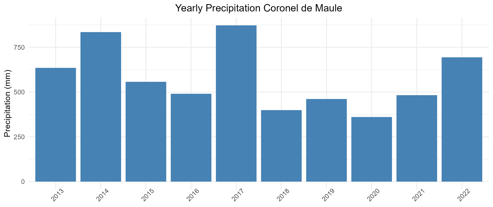
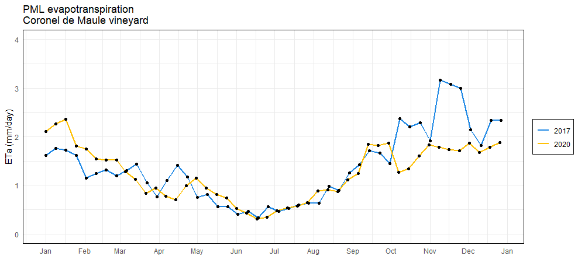
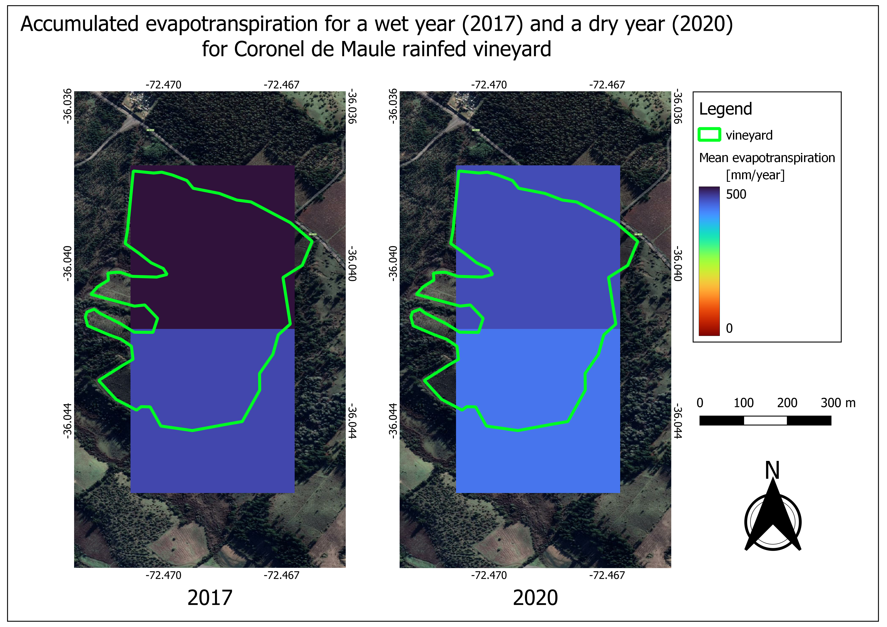

TESTThe proper quantification of transpiration is a key challenge for soil and plant scientist but also a relevant information for farmers to forecast how the yield is coming or to plan fertilization or irrigation managements. It is also relevant for decision makers to understand the water balance at plot, catchment or even region or country level to develop measurements against water scarcity.

The relationship between rainfall and evapotranspiration is not always direct because many factors affects the movement of the infiltrated water to the atmosphere such as the soil physical and chemical properties, the type of vegetation, phenological stage, leaf area index, the atmospheric conditions and the human practices, pruning for instance.

In this exercises I would like to explore the relationship between rainfall and evapotranspiration comparing a dry and a wet year in a mediterranean vineyard located in [Coronel de Maule, Chile](https://goo.gl/maps/RSq1pPVn3kfx8reF9) (Figure 1). In one of the best [*terroirs*](https://en.wikipedia.org/wiki/Terroir) of Chile. To do this I would also like to carry on the analysis using open access *in situ* meteorological data and evapotranspiration remote sensing data.

*Figure 1. Study area. Since PML product spatial resolution is too coarse to use many pixels, One pixel was taken into account to extract the evapotranspiration time serie for both 2017 (wet year) and 2020 (dry year) and is shown with the green triangle.*

To select the dry and wet years, I looked for the closest weather station to the vineyard (1 km) and the yearly accumulated precipitation was downloaded from the meteorological weather network of INIA ([agrometeorología](https://agrometeorologia.cl/)) (Figure 2). The 2017 was selected as the wet year with 872.5 mm and the 2020 as the dry year with 360 mm.

Evapotranspiration (ET) is a component in hydrological cycle and represent the sum of evaporation of water from surfaces and the transpiration of plants, it modulate the souranding temperature and it is relatable to plant growth and photosytesis. The ET product used correspond to Penman-Monteith-Leuning version 2 (Gan et al., 2018). It is explained in Zhang et al., 2019 and it calculates transpiration, evaporation, canopy interception and gross primary production.

*Figure 2. Yearly precipitation for Coronel de Maule weather station. It is important to mention that for all years the amount of data was over 98 % but for 2018 the amount of data was 72 %. Because of the last 2018 was not a possible candidate for being the wet nor dry year.*

In Figure 3 we can notice the temporal variation in evapotranspiration for the full year. We can see that from april (starting month of hydrological year) until october, the evapotranspiration remains constant but when the plants are at their maximum water consumption levels (during spring and summer) the accumulated rainfall is relevant and for a wetter year we can see a higher level of evapotranspiration. Being the maximum difference in the period November-December where the evapotranspiration varied from 1.8 mm/day for the dry year to 3 mm/day for the wet year.

*Figure 3. PML evapotranspiration time serie for wet year (2017) and dry year (2020). We can notice that for most of the period the evapotranspiration is similar but for summer the water consumption increases when there was more rain in the current year.*

Regarding the total evapotranspiration, in Figure 4 we can see that for a wet year the total amount was 501 mm and for a dry year was 460 mm. Just the upper pixel was taked into account for the analisis because was almost 100 % inside the vineyard. That shows one of the downsides of using PML dataset to study evapotranspiration at plot scale. Some other evapotranspiration products exists but are either constrained to a specific region such as [openET](https://github.com/Open-ET/openet-ssebop) or are time consuming to compute such as [METRIC](https://www.sciencedirect.com/science/article/pii/S0378377419301180).

*Figure 4. Accumulated evapotranspiration for the wet year (left) and dry year (right).*

As conclusion we could say that the current methodology is a first approximation to the proper quantification of evapotranspiration at plot scale but still more research and work is necessary. For instance validate the product with in situ data, use soil water plant atmosphere models to estimate fluxes as evapotranspiration but also their components separately in evaporation and transpiration. Use products with higer spatial resolution as [METRIC](https://www.sciencedirect.com/science/article/pii/S0378377419301180) or [downsample evapotranspiration products using Deep Learning techniques](https://www.mdpi.com/2072-4292/14/22/5876). Also the relationship between the past years with the current evapotranspiration is something that we have to have in mind because if we are in a series of dry years and then we get a wet one is not the same as being in a series of wet years and having a new wet year and the same with extensive droughts, [the soil moisture memory](https://www.sciencedirect.com/science/article/pii/S0022169420310830).

All the data required to do the analysis and figures is available under [GPLv3](https://www.gnu.org/licenses/gpl-3.0.html) license in my [GitHub repository](https://github.com/LRiveroIribarne/visualization-portfolio) :)

------

## References

Gan, R., Zhang, Y.Q., Shi, H., Yang, Y.T., Eamus, D., Cheng, L., Chiew, F.H.S., Yu, Q., 2018. Use of satellite leaf area index estimating evapotranspiration and gross assimilation for Australian ecosystems. Ecohydrology, doi:10.1002/eco.1974

Zhang, Y., Kong, D., Gan, R., Chiew, F.H.S., McVicar, T.R., Zhang, Q., and Yang, Y., 2019. Coupled estimation of 500m and 8-day resolution global evapotranspiration and gross primary production in 2002-2017. Remote Sens. Environ. 222, 165-182, doi:10.1016/j.rse.2018.12.031
